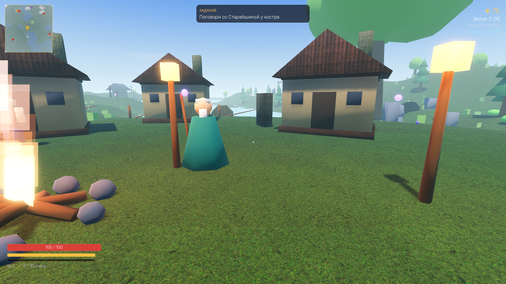
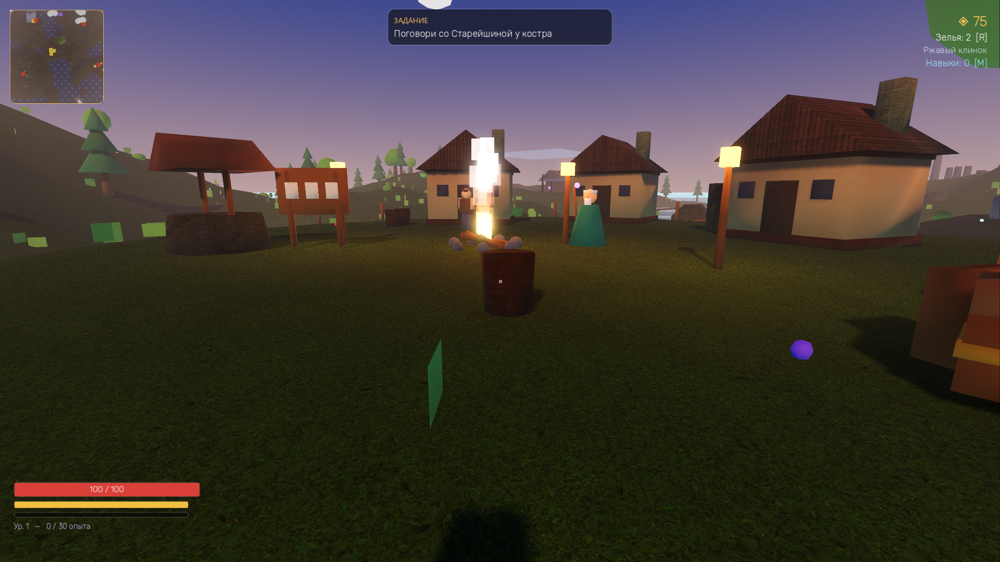
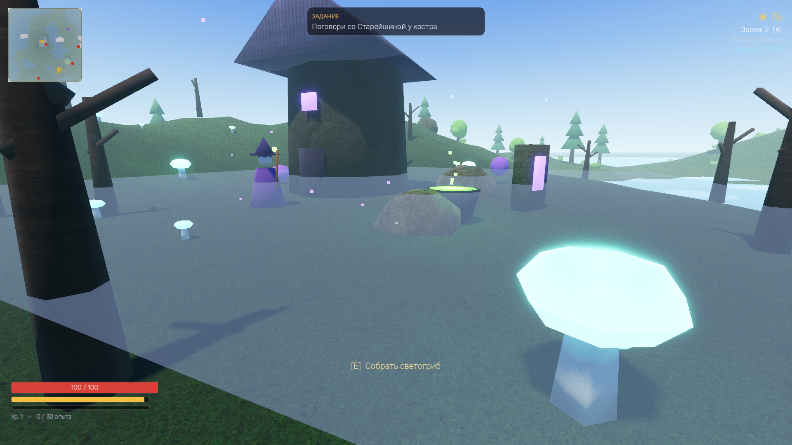
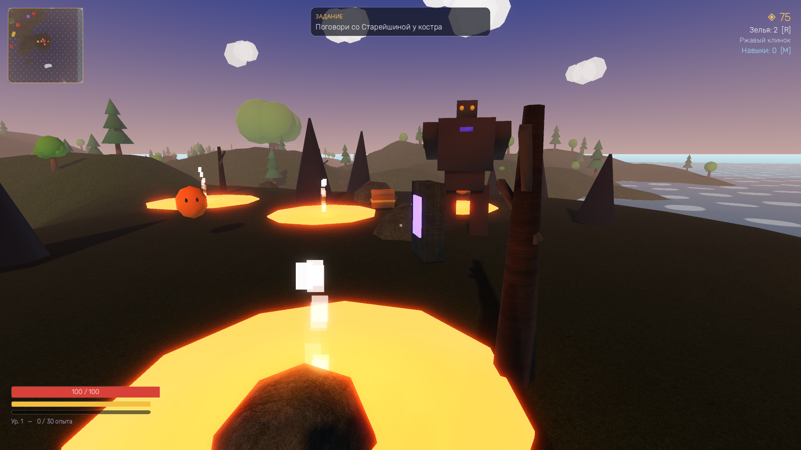
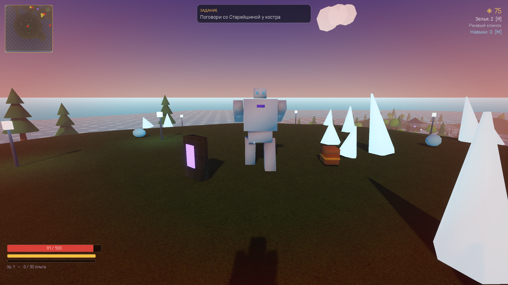
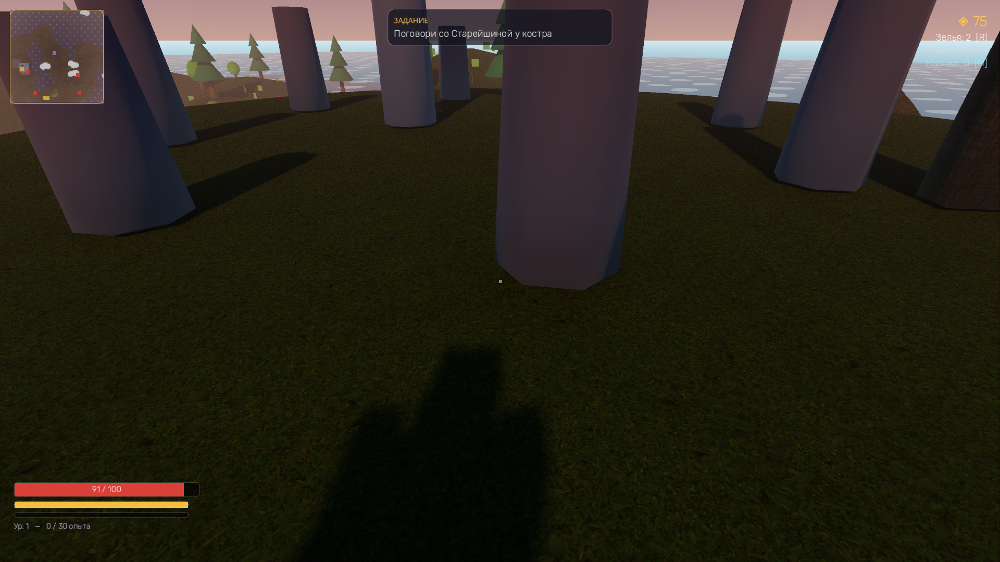

# EMBERMOOR

Низкополигональная фэнтези-RPG на Godot 4. Весь мир, персонажи, звук и музыка
генерируются процедурно — ни одного внешнего ассета.

## Запуск
Двойной клик по `ИГРАТЬ.bat` (или открой проект в Godot и нажми F5).

Перед игрой: сложность (Легко/Нормально/Сложно), класс (Воин/Разбойник/Паладин), размер мира.
Прогресс сохраняется автоматически (смена квеста) и через паузу — кнопка «Сохранить».
«ПРОДОЛЖИТЬ» в меню загружает мир по сохранённому сиду со всем прогрессом.
Настройки графики — в главном меню: тени, сглаживание, дальность прорисовки деталей,
свечение, SSAO, туман, полный экран. Подойдут для любого компьютера.

## Управление
| Клавиша | Действие |
|---|---|
| WASD | движение |
| Мышь | камера |
| ЛКМ | атака (комбо из 3 ударов) |
| Пробел | прыжок |
| Q | перекат (неуязвимость) |
| Shift | бег |
| E | взаимодействие / диалоги |
| R | выпить зелье |
| Esc | пауза |

## Что делать
1. Поговори со Старейшиной у костра — убей 6 слаймов на лугу.
2. Вернись за наградой, затем победи Каменного Голема в руинах на северо-востоке.
3. Кузнец Гримм улучшает клинок за монеты (сундуки и враги дают золото).
4. После победы Старейшина отправит тебя к ведьме Море в Топкий лес (северо-запад):
   светогрибы → Хранитель Топей → финальная награда.
5. Дальше — Тайна портала: Магмовый Голем в Пустошах, Морозный в Пиках, затем Врата на юге.
6. Опыт и квесты дают очки навыков — древо на [M]: Ветер (скорость), Ярость (урон), Жизнь (здоровье).
7. Доска заданий в деревне — бесконечные охоты за монеты и очки навыков.
8. 7 древних камней с лором острова и алтарь Великого Древа в центральной роще.
9. Процедурные подземелья: ищи фиолетовые разломы у руин и в Пустошах — комнаты, ловушки, факелы и босс Повелитель Мрака.
10. Элитные монстры (аура) роняют руны: Огонь поджигает, Лёд замедляет, Вампиризм лечит. Вставляй их у кузнеца!
11. Оружейные камни падают с боссов и врагов: редкость (белый → синий → фиолетовый → оранжевый) даёт бонус урона.
12. Смерть = возрождение у костра.

## Техническое
- Godot 4.x, GDScript, Forward+ (авто-фолбэк на D3D12/OpenGL)
- Процедурный остров с flatten-зонами, вода с шейдером, смена дня и ночи
- Враги: слаймы (прыгают), скелеты (телеграф атаки), Голем (босс, AOE-слэм)
- Звуки — CC0-пакеты Kenney.nl (res://audio), текстуры — CC0 ambientCG/Polyhaven (res://textures)
- Текстурный шейдер террейна (трава/скала по наклону), трипланар-материалы на постройках
- Музыка синтезируется при запуске
- Дома, руины, деревья и камни с коллизиями; ведьмина башня, котёл, туман и светящиеся грибы
- Миникарта с метками NPC/боссов/портала; серпантин на Ледяные пики с фонарями
- Дальний cull мелких пропсов (visibility ranges) + регулировка в настройках — бережёт видеокарту
- Локации: деревня, луг, руины, Топкий лес, Пепельные пустоши, Ледяные пики, Древний портал, Роща Древа
- Автоприцел: при ударе персонаж доворачивается к ближайшему врагу в конусе камеры
- Весь звук (удары, монеты, левелапы) и музыкальный луп имеют процедурный фолбэк

## Скриншоты

| | |
|---|---|
|  |  |
|  |  |
|  |  |

## Скачать

Готовая сборка (Windows): страница [Releases](../../releases) — скачай zip из последнего релиза, распакуй и запусти `Embermoor.exe`. Установка не нужна.

## v1.0.0-alpha — что нового

- **Менеджер миров**: несколько слотов сохранений с карточками (сид, класс, уровень, время игры), удаление с подтверждением, ввод имени и сида при создании мира
- **Процедурные подземелья**: комнаты и коридоры, сталактиты, факелы с динамическим светом, шипы и камнепады, сундуки и босс Повелитель Мрака
- **Дальний бой**: охотничий лук с натяжением тетивы (ПКМ), Посох Стихий — файерболы (ЛКМ) и ледяные копья с замедлением (ПКМ), мана
- **Фазы боссов**: на 50% HP боссы впадают в ярость — быстрее, злее, светятся
- **Элитки** с аффиксами: Огненный след, Морозное замедление, Вампиризм
- **Полоска босса** с именем и стихией, **редкость лута** (Обычный → Легендарный) со световыми лучами
- **Руны** для оружия у кузнеца, оружейные камни (+урон), круглая миникарта, журнал на [J]

## Сборка из исходников

1. Установи [Godot 4.x](https://godotengine.org/download) (обычная версия, не .NET).
2. Открой проект (`project.godot`) и нажми F5 — всё содержимое генерируется процедурно, ассетов докачивать не надо.
